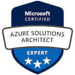

## 自己紹介

C#を中心に、Java、Ruby、node.jsなどによるソフトウェア開発・運用を10年以上経験しています。その後、テクニカルサポートを4年やっており、前記の言語に加えて、GoやPHP、Pythonのコードリーディングや修正パッチの作成を行っています。
AWS上でのWindows Server/IIS/ASP.NET Coreの運用経験、一方Azure上でのRHELやOpenShiftのサポート経験があります。
2013年よりMicrosoft　MVPを受賞し、ブログでの執筆、勉強会での登壇などを行っています。執筆依頼や登壇依頼は  [contact me](#contact) まで。
物理学を専攻し、理学博士号をもっています。論文リストは [Here](https://scholar.google.co.jp/citations?user=qR0zzd4AAAAJ&hl=ja)。

### 現職

[New Relic 株式会社](https://newrelic.co.jp/)のテクニカルサポートマネージャー

個人的には次の技術に興味を持っています。

- パブリッククラウド (Microsoft Azure, AWS, GCP など)
- C# (.NET Core, ASP.NET Core, Visual Studio拡張)
- OpenTelemetry
- Radius
- kubernetes
- Microsoft Quantum (Q# およびトポロジカル量子コンピューター)

### Public Speaking

#### Japanese

- [AKS Best Practices 解説(動画)](https://www.youtube.com/watch?v=YFoVGgWbOQc&feature=youtu.be)
- [Q# ハンズオン](http://www.tanaka733.net/QSharp-Handson/)
- [Q# 基礎](https://www.slideshare.net/tanakata/q-ver11)
- Q# Coding Contest振り返り
- [ゼロから始めるQ#](https://www.slideshare.net/tanakata/q-117200034)
- [Developing & Deploying .NET Core on Linux](https://www.slideshare.net/tanakata/20170311-developing-deploying-net-core-on-linux)
- [ASP.NET Core のお気に入りの機能たち (docker向け)](https://www.slideshare.net/tanakata/aspnet-core-docker-81037744)

#### English

- [Azure Cloud Provier in OpenShift 3.10 at London OpenShift meetup](https://www.slideshare.net/tanakata/new-features-of-azure-cloud-provider-in-openshift-container-platform-310)
- [OpenShift on Azure Stack at London OpenShift meetup](https://www.slideshare.net/tanakata/open-shift-on-azure-stack)
- [SQL Server on RHEL](https://www.slideshare.net/tanakata/introduction-to-sql-server-on-rhel)
- [.NET Core on OpenShift at London OpenShift meetup](https://www.slideshare.net/tanakata/deep-dive-openshitt-on-azure-net-core-on-openshift)
- [Getting Started with Microsoft Azure at Red Hat Tech Exchange APAC 2016](https://rhte2016.sched.com/event/894x/getting-started-with-microsoft-azure)
- [An introduction to .NET core on RHEL at Red Hat Tech Exchange APAC 2016](https://rhte2016.sched.com/event/895A/an-introduction-to-net-core-on-rhel)

### Blog Sites

- [Personal Blog](https://tech.tanaka733.net/)
- [Personal Blog(英語)](https://tech.en.tanaka733.net/)
- [Red Hat Debelopers](https://developers.redhat.com/blog/author/rhtakayoshitanaka/)

### Contents

- [Presentations](https://www.slideshare.net/tanakata/presentations)
- [C# 6.0で知っておくべき12の新機能](https://www.buildinsider.net/language/csharplang/0600)
- [連載：コードから触るIIS 8](https://www.buildinsider.net/web/iis8)

### Products

- [Chatwork API (NuGet)](https://www.nuget.org/packages/Chatwork.Api/)
- [NLog.Targets.AmazonSNS (NuGet)](https://www.nuget.org/packages/NLog.Targets.AmazonSNS/)
- [OpenShift Client C# SDK (NuGet)](https://www.nuget.org/packages/OpenShift.Service.Core/)
- [OpenShift for VisualStudio (Visual Studio Marketplace)](https://marketplace.visualstudio.com/items?itemName=tanaka733.vstoolsforopenshifttanaka733)
- [Open for PSCmdlet (Visual Studio Marketplace)](https://marketplace.visualstudio.com/items?itemName=tanaka733.OpenForPSCmdlet)
- [CsProjUtil (Visual Studio Marketplace)](https://marketplace.visualstudio.com/items?itemName=tanaka733.CsProjUtil)

### Certification

- [Microsoft Certified: Azure Solutions Architect Expert](https://www.youracclaim.com/badges/14a0ded8-3af1-43c2-880e-326be600785d/public_url)

- [AWS Certified Solution Architect - Associate](https://www.certmetrics.com/amazon/public/badge.aspx?i=1&t=c&d=2019-06-03&ci=AWS00896804)
- [AWS Certified Cloud Practitioner](https://www.certmetrics.com/amazon/public/badge.aspx?i=9&t=c&d=2019-05-20&ci=AWS00896804)

### Contact

- [Twitter](https://twitter.com/tanaka_733)
- [LinkedIn](https://www.linkedin.com/in/takayoshi-tanaka/)
- [SpeakerHub](https://speakerhub.com/speaker/takayoshi-tanaka/shared/public-presentations)
